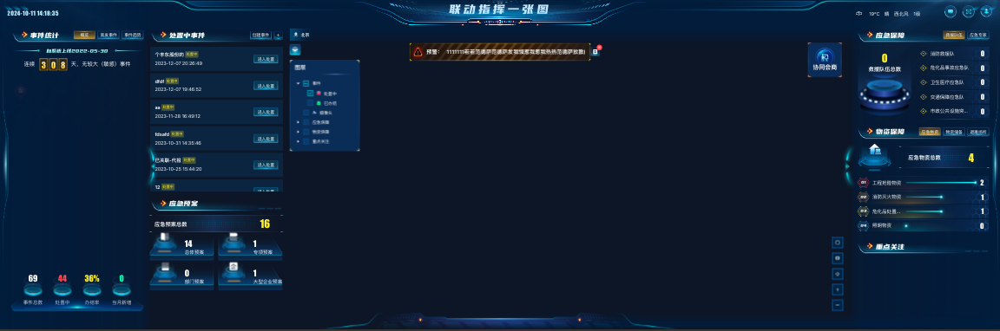

# 中大屏自适应

## 根据屏幕分辨率自适应大小
1. 1440 * 1080 (4:3) 屏幕

2. 1920 * 1080 (16:9) 屏幕

3. 2160 * 1080 (2:1) 屏幕

4. 3840 * 1270 (3:1) 屏幕

5. 4200 * 1080 (35:9) 屏幕

6. 4320 * 1080 (4:1) 屏幕

## 根据屏幕高宽比例自动适配左右两侧列数
